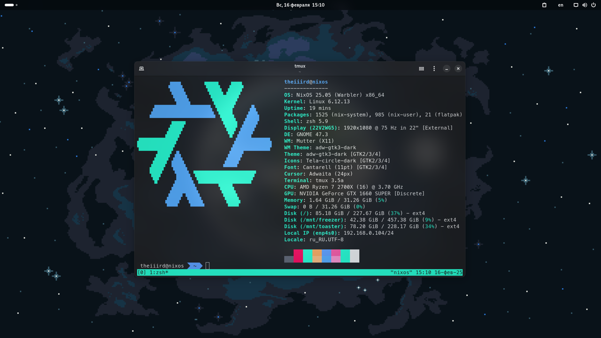
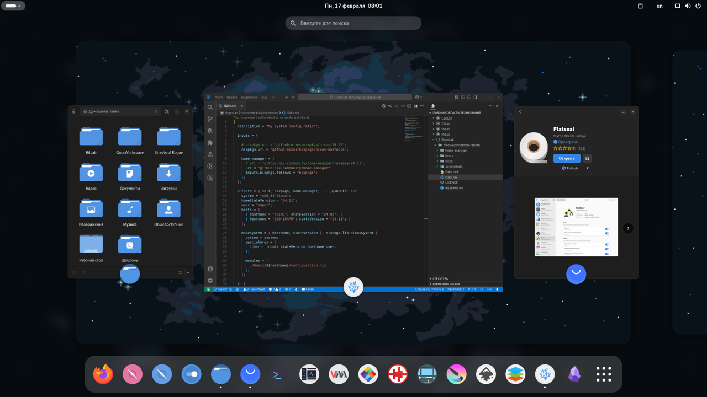

# ❄️ NixOS Workstation Config Reborn

This repository is a fork of [Andrey0189's NixOS Config Reborn](https://github.com/Andrey0189/nixos-config-reborn). Welcome to my redesigned NixOS configuration built for efficiency and aesthetics. Right now I'm trying to commit something every day. Let's see how long I can go.



You can still find Andrey0189's old configuration [here](https://github.com/Andrey0189/nixos-config)

## ✨ Features

- 🖥️ **Multiple Hosts Support**: Easily configure for different hosts
- 🏠 **Home Manager Integration**: Comprehensive configuration for user environments
- 🧇 **Tmux**: Custom hotkeys for efficient terminal management
- 🌟 **Zsh**: Optimized shell setup with numerous aliases for quick access to commands

## 🚀 Installation

To get started with this setup, follow these steps:

1. **Install NixOS**

   If you haven't already installed NixOS, follow the [NixOS Installation Guide](https://nixos.org/manual/nixos/stable/#sec-installation) for detailed instructions.

2. **Clone the Repository**

    ```bash
    git clone https://github.com/TheIIIrd/nixos-workstation-reborn.git ~/.nix && cd ~/.nix
    ```

3. **Copy one of the hosts configuration to set up your own**

    ```bash
    cd hosts
    cp -r nixos <your_hostname>
    cd <your_hostname>
    ```

4. **Put your `hardware-configuration.nix` file there**

    ```bash
    cp --no-preserve=mode /etc/nixos/hardware-configuration.nix .
    ```

5. **Edit `hardware-configuration.nix` for disk mounting if needed**

    ```bash
    vim hardware-configuration.nix
    ```

6. **Edit `hosts/<your_hostname>/local-packages.nix` and `home-manager/home-packages.nix` files if needed**

    ```bash
    vim local-packages.nix
    vim ../../home-manager/home-packages.nix
    ```

7. **Edit `home-manager/modules/git.nix`**

    ```bash
    vim ../../home-manager/modules/git.nix
    ```

8. **Edit `nixos/modules/default.nix` and `nixos/modules/graphics/default.nix`**

    ```bash
    vim ../../nixos/modules/default.nix
    vim ../../nixos/modules/graphics/default.nix
    ```

9. **Specify the parameters for `nixos/modules/zapret.nix`**

    ```bash
    nix-shell -p zapret --command blockcheck
    vim ../../nixos/modules/zapret.nix
    ```

10. **Finally, edit the `flake.nix` file**

    ```bash
    sed -i -e 's/theiiird/<your_username>/g' \
       -e '/{ hostname = "nixos-blank"; stateVersion = "24.05"; }/d' \
       -e 's/hostname = "nixos"/hostname = "<your_hostname>"/' \
       -e 's/stateVersion = "24.11"/stateVersion = "<your_state_version>"/' \
       -e 's/homeStateVersion = "24.11";/homeStateVersion = "<your_home_manager_state_version>";/' \
       ~/.nix/flake.nix
    ```

    ```diff
    ...
      outputs = { self, nixpkgs, home-manager, ... }@inputs: let
        system = "x86_64-linux";
    --  homeStateVersion = "24.11";
    ++  homeStateVersion = "<your_home_manager_state_version>";
    --  user = "theiiird";
    ++  user = "<your_username>";
        hosts = [
    --    { hostname = "nixos"; stateVersion = "24.11"; }
    --    { hostname = "nixos-blank"; stateVersion = "24.05"; }
    ++    { hostname = "<your_hostname>"; stateVersion = "<your_state_version>"; }
        ];
    ...
    ```

11. **Rebuilding**

    ```bash
    cd ~/.nix
    git add .
    sudo nixos-rebuild boot --flake ./#<hostname>
    # or nixos-install --flake ./#<hostname> if you are installing on a fresh system
    ```

    ```bash
    # reboot your system and run
    nh home switch
    ```

12. **Configure Flatpak and gnome keybindings switch-input-source if needed**

    ```bash
    flatpak remote-add --if-not-exists flathub https://dl.flathub.org/repo/flathub.flatpakrepo
    flatpak install org.gtk.Gtk3theme.adw-gtk3 org.gtk.Gtk3theme.adw-gtk3-dark com.github.tchx84.Flatseal
    ```

    ```bash
    gsettings set org.gnome.desktop.wm.keybindings switch-input-source-backward "['<Alt>Shift_L']"
    ```

13. **Copy corefonts to the home directory**

    ```bash
    # the path to corefonts-1 may vary
    cp --no-preserve=mode /nix/store/ciwacrng6v01ih6hl4x6db39k4m41add-corefonts-1/share/fonts/truetype/* ~/.local/share/fonts
    ```

## 😎 Enjoy!



## 🤝 Contributions

Feel free to fork the repository and submit pull requests if you'd like to contribute improvements. Open issues if you encounter any problems with the config or have ideas for new features.
